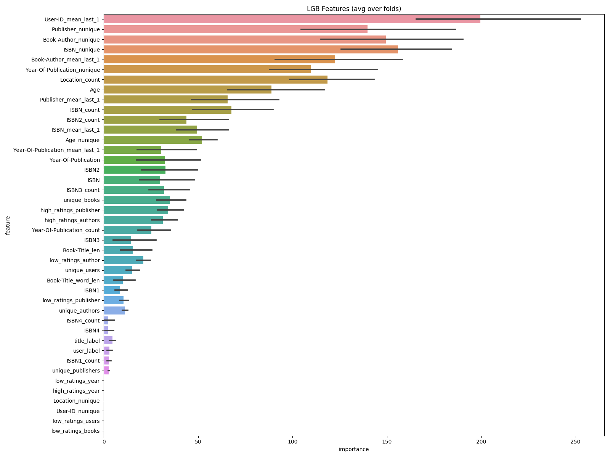

## 图书评分预测

### 标签分布

- 训练集
```text
0     482512
8      60088
10     48938
7      43333
9      41194
5      30827
6      20545
4       4830
3       3212
2       1481
1        904
```

- ensemble.py class3 76.2221
```text
0.0    155521
8.0     41335
4.0      8496
3.0       417
1.5       399
5.5        67
```
- ensemble.py class4 75.5705	
```text
0.00    177316
9.00     21919
4.50      3388
6.00      2136
7.50       638
3.00       592
1.25       238
2.50         6
5.75         2
```

- stacking_cls.py 75.002
```text
0     184215
6       6484
8       5116
7       3052
5       2806
2       1378
1       1120
9        742
10       738
4        314
3        270                
```

- ensemble_v2.py 76.4648
```text
0.000000    154354
7.000000     40824
4.666667      7141
2.333333      3228
3.500000       428
1.166667       225
5.833333        35
```


## 特征工程

```python
# 加入 效果差
# data['Publisher_count'] = data.groupby('Publisher')['ISBN'].transform('count')
```
